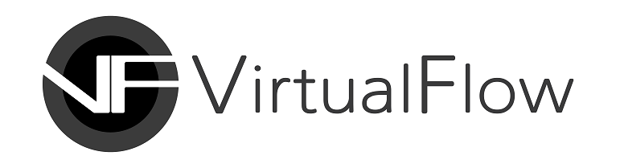

# VirtualFlow Studio (Beta Version) - WIP

## A High-End 3D Tool for Content Creators

**VirtualFlow** provides you with a powerful toolset for creating Metaverse, with which anyone can create high-quality 3D contents fast and with ease, in Unreal Engine. Our goal is to demolish the technical barrier keeping you from developing various digital contents and thus bring about a future where you can become a digital creator who bestows upon his audience a splendid virtual reality.

## Provision of Brand-New Gameplay Framework and Powerful Toolset

**VirtualFlow Studio**—which was created with the help of the **T4Framework** plugin—is an Integrated Development Environment that enables you to utilize the powerful features of the Unreal Engine even without the technical knowledge on **Blueprint Visual Scripting** or **C++** programming language. **VirtualFlow Studio** provides you with a brand-new gameplay framework and a professional-level toolset, with which anybody can create an open-world multiplayer content. 

  

<a href="https://www.unrealengine.com/en-US/megagrants" target="_blank">2020 : Awarded "Epic MegaGrant" from Epic Games Inc</a>
  

## A Free Demo of VirtualFlow Studio (for Unreal Engine 5 EA) is Here For You

**VirtualFlow Inc.** is a startup that’s made up of veteran software engineers with more than 15 years of experience in the production of several MMORPGs. After more than two years of development, we have finally released a beta version you can test out, which is compatible with the **Unreal Engine 5 Early Access**. We plan to continuously update our software to make it function properly within the officially released version of the **Unreal Engine 5.**

## VirtualFlow Studio

### Information
- VirtualFlow Studio Version 
  - T4Framework v1.0a
- Unreal Engine Version
  - UE5.0 Early Access 1
- Supported Platform
  - Windows 64bit
- License
  - FREE ("Unreal Engine 5 Early Access" Version)
- Showcase
  - <a href="https://t4framework.com/Showcase/" target="_blank">https://t4framework.com/Showcase</a>
- Assets you need to download to follow along the tutorials (Free Assets)
  - HelloWorld Project
    - <a href="https://www.unrealengine.com/marketplace/en-US/product/animation-starter-pack" target="_blank">Animation Starter Pack</a>
    - <a href="https://www.unrealengine.com/marketplace/en-US/product/fps-weapon-bundle" target="_blank">FPS Weapon Bundle</a>
  - TutorialGame_Example Project
    - <a href="https://www.unrealengine.com/marketplace/en-US/product/c93f1fa73dad4adf9a3d09883d8c8dec" target="_blank">City of Brass: Environments</a>
    - <a href="https://www.unrealengine.com/marketplace/en-US/product/unreal-learning-kit-games" target="_blank">Unreal Learning Kit: Games</a>

### Tutorials
- <a href="https://wiggly-burst-46b.notion.site/Tutorial-0-Installing-Unreal-Engine-7ef95f459fbe406988ead87703381baa" target="_blank">Tutorial 0: Installing Unreal Engine</a>
- <a href="https://wiggly-burst-46b.notion.site/Tutorial-1-Introduction-to-T4Framework-Setup-for-the-Following-Tutorials-77f7bfcbc68e4fe19c13ee416ee7972d" target="_blank">Tutorial 1: Introduction to T4Framework & Setup for the Following Tutorials</a>
- <a href="https://wiggly-burst-46b.notion.site/Tutorial-2-Character-Configuration-1-000936d0c6884416a53e605ec08eb468" target="_blank">Tutorial 2: Character Configuration 1</a>
- <a href="https://wiggly-burst-46b.notion.site/Tutorial-3-Character-Configuration-2-2fa384b94b9c49a890c73f1ade686164" target="_blank">Tutorial 3: Character Configuration 2</a>
- <a href="https://wiggly-burst-46b.notion.site/Tutorial-4-Configuring-Weapons-cbf4710673a6435fbd0db6839768218c" target="_blank">Tutorial 4: Configuring Weapons</a>
- <a href="https://wiggly-burst-46b.notion.site/Tutorial-5-Project-Creation-Basic-Configuration-of-Player-and-Weapon-DB-df6d4eb8954740c981c086974241f681" target="_blank">Tutorial 5: Project Creation & Basic Configuration of Player and Weapon DB</a>
- <a href="https://wiggly-burst-46b.notion.site/Tutorial-6-Map-Creation-and-Project-World-Configuration-13110474096c4e138019bb0f5dae87b5" target="_blank">Tutorial 6: Map Creation and Project World Configuration</a>
- <a href="https://wiggly-burst-46b.notion.site/Tutorial-7-Navigation-Settings-59bc7d53abde4f1fa55d306583523719" target="_blank">Tutorial 7: Navigation Settings</a>
- <a href="https://wiggly-burst-46b.notion.site/Tutorial-8-Setting-up-Action-Pack-Skills-Reactions-b29fa1561de54985bc5ad3f085887a40" target="_blank">Tutorial 8: Setting up Action Pack (Skills, Reactions)</a>
- <a href="https://wiggly-burst-46b.notion.site/Tutorial-9-Adding-Skill-and-Reaction-to-Project-cd52565b7cda471ca395ab5b0a69510c" target="_blank">Tutorial 9: Adding Skill and Reaction to Project</a>
- <a href="https://wiggly-burst-46b.notion.site/Tutorial-10-Configuring-NPC-6b45f83707c34407942a2be5eb9f4ec7" target="_blank">Tutorial 10: Configuring NPC</a>
- <a href="https://wiggly-burst-46b.notion.site/Tutorial-11-Items-Configuration-and-Drop-179ae336869f45858b36992186c44730" target="_blank">Tutorial 11: Items Configuration and Drop</a>
- <a href="https://wiggly-burst-46b.notion.site/Tutorial-12-Setting-up-a-Quest-Basic-Settings-d0b3ed2f4250401dab9602d3f334aa44" target="_blank">Tutorial 12: Setting up a Quest (Basic Settings)</a>
- <a href="https://wiggly-burst-46b.notion.site/Tutorial-13-Configuring-Quests-Setting-up-Dialogues-60524d863faa4ec3adc739c87c705668" target="_blank">Tutorial 13: Configuring Quests (Setting up Dialogues)</a>
- <a href="https://wiggly-burst-46b.notion.site/Tutorial-14-Configuring-Client-Play-4c5c1e13c58e4a7ca0d38d70c490695b" target="_blank">Tutorial 14: Configuring Client Play</a>
- <a href="https://wiggly-burst-46b.notion.site/Tutorial-15-Setting-Up-Event-Triggers-cad258f289e546668339dc8d55bafd48" target="_blank">Tutorial 15: Setting Up Event Triggers</a>
- <a href="https://wiggly-burst-46b.notion.site/Tutorial-16-Project-Packaging-Single-Mode-cdbfaecc0b514ae8bc36a2db22ee5b84" target="_blank">Tutorial 16: Project Packaging (Single Mode)</a>
- <a href="https://wiggly-burst-46b.notion.site/Tutorial-17-Running-a-Server-Incorporating-it-into-a-Package-e7d09be3f2904fa890c149b7285b8382" target="_blank">Tutorial 17: Running a Server & Incorporating it into a Package</a>

### Community
- Forum 
  - In progress...
- Customer Service
  - help@virtualflowinc.com
